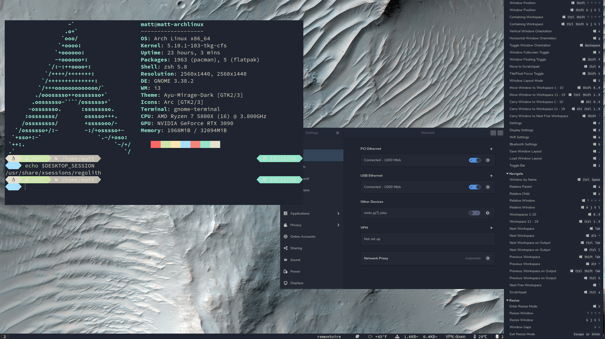

# regolith-de

NOTE ON REGOLITH 2.0: Yes, I know Regolith 2.0 has been released. I've been working on converting the PKGBUILD over to 2.0, but 2.0 basically completely changes the way Regolith works from the ground up on a fundamental level, and many of the packages in 1.6 are gone, there are many new packages that replace them, and most of them are custom-built by Ken (the Regolith creator) himself. I'm going to have to rewrite a couple patches and completely rewrite the PKGBUILD. I'm about 40% done as of July 01 2022. I'll get it done as soon as I can. 



Standalone Regolith desktop environment for Arch Linux

This is a PKGBUILD for Regolith Linux's fork of the i3 (plus Gnome-flashback) window manager/desktop environment, to rather hackily rip the desktop environment for Regolith Linux and make it work on Arch Linux and it's derivatives. 

I will check weekly for upstream updates to the launchpad packages, which is honestly probably way more often than necessary - Regolith is based on Ubuntu after all, and so it doesn't update its DE packages at the same rate as we're used to on Arch. 

Where possible (more accurately, where I've found possible), Arch/AUR packages will be used if compatible versions exist. Currently Arch's i3-gaps, rofi, and some other packages are being used.

Because of the way AUR packages work, combined with Ubuntu-specific idiosyncracies in the original config file for Regolith's i3, I've had to bundle the regolith build of st - the simple terminal, and use that as the default terminal. Feel free to change it in the config file (`/etc/regolith/i3/config`) just like you would with regular i3, it's just the only other option was for there to be no default terminal, or else try and choose one that some people will have and others won't. I get around this by just including the terminal, and luckily it's st so it's really small. It's its own package, so you can also remove it (`sudo pacman -R regolith-st`), it's not a dependency of anything, it just gets installed with the meta-package. 

As of the latest update to Regolith proper, it seems that my package no longer conflicts with gnome-shell or GDM. If you have any issues let me know. 

## Contributing

PRs are welcome.

## Installation

**Manually Using `makepkg`**

1. Install git and clone the AUR package.

    ```
    $ sudo pacman -S git
    
    $ git clone https://aur.archlinux.org/regolith-de.git && cd regolith-de
    ```

2. [Install the packages](https://wiki.archlinux.org/index.php/Arch_User_Repository#Installing_and_upgrading_packages)

    ```
    $ makepkg -si
    ```

4. Start Regolith Desktop Environment

    The best way obviously is through a display manager (DM). It definitely works with LightDM and SDDM, it should also work with GDM. Just select "Regolith" from the list of desktop environments.

    The other way is of course to run the session from a manual xorg startup:

    ```
    $ sudo pacman -S xorg-xinit

    $ echo 'exec regolith-session' > ${HOME}/.xinitrc

    $ startx
    ```

**Using an AUR Helper**

`makepkg` will not allow pulling dependencies from the AUR, only the official repos, so a meta-package that pulls in all the separate packages of the package base wouldn't work. However, AUR helpers *can* have AUR dependencies, so if you're using an AUR helper you will just run (using paru as an example, feel free to substitute yay/paru/pamac/etc):

1. `paru -S regolith-full`

This will build and install regolith-i3, regolith-i3xrocks, regolith-desktop-config, regolith-st, and regolith-styles, the five packages that make up the entire desktop environment (along with their dependencies). 
## Looks/Styles

   Regolith has a pretty cool (IMO) way of styles/theming, and I've kept all that intact. 
    
 - You can run `regolith-look` to get a list of commands, but basically, `regolith-look stage` will do the initial setup of copying the regolith and Xresouces files to your user directory (in their own, independent locations, so they will NOT overwrite ~/.Xresources or ~/.config/i3/config, they will go in ~/.Xresources-regolith and ~/.config/regolith/i3/config). 
    
 - To set your look, run `regolith look set <stylename>`, from the list of style directories in /etc/regolith/styles (also can be retrieved with `regolith-look list`), such as cahuella, lascaille (the default), ayu, ayu-dark, pop-os, ubuntu, etc.
 
 - `regolith-look refresh` will refresh it for your current session, changing the terminal theme, i3xrocks theme, and wallpaper (for the styles that have their own wallpaper). It's pretty simple. 

Note: VMs generally don't play well with picom/compton compositing. If you are running Regolith in a VM and have any issues with performance, make sure to kill the compositor.


## Credits

Credit to [Kevin Gilmer](https://github.com/kgilmer) for the creation of Regolith Linux as well as invaluable insight during the creation of this PKGBUILD. 
Pull requests are welcome, the number of packages here is enormous (it is a full desktop environment, after all), and this is my first software/package management project of any kind. 

Credit also to [Avinash Duduskar](https://github.com/Strykar), for valuable contributions. 
